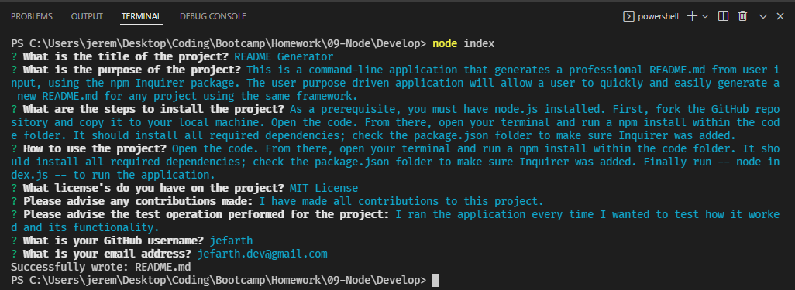

# README Generator
  

## Description
  This is a command-line application that generates a professional README.md from user input, using the npm Inquirer package. The user purpose driven application will allow a user to quickly and easily generate a new README.md for any project using the same framework.

  This README.md is a creation from the use of the application itself.

## Preview
  [Video Preview](https://drive.google.com/file/d/1o-sRae8cG-PhPY9mXVTjLawrkEruFLyB/view)

  
## Table of Contents 

  * [Installation](#installation)
  * [Usage](#usage)
  * [License](#license)
  * [Contributions](#contributions)
  * [Tests](#tests)
  * [Questions](#questions)

## Installation
  Follow these steps to install the application: As a prerequisite, you must have node.js installed. First, fork the GitHub repository and copy it to your local machine. Open the code. From there, open your terminal and run a npm install within the code folder. It should install all required dependencies; check the package.json folder to make sure Inquirer was added.

## Usage
  To use this application: Open the code. From there, open your terminal and run a npm install within the code folder. It should install all required dependencies; check the package.json folder to make sure Inquirer was added. Finally run -- node index.js -- to run the application.

## License
  This project is licensed under: MIT License.

## Contributions
  Contributions made by: I have made all contributions to this project.

## Tests
  Testing on this application was performed by: I ran the application every time I wanted to test how it worked and its functionality.

## Questions
  If you have any questions about the application, please contact "jefarth" directly at jefarth.dev@gmail.com